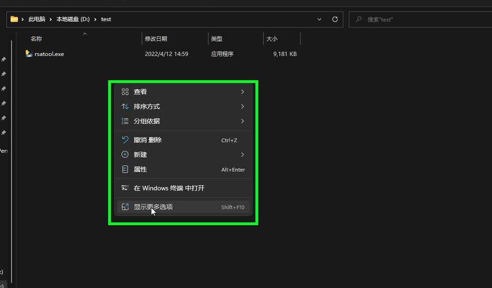
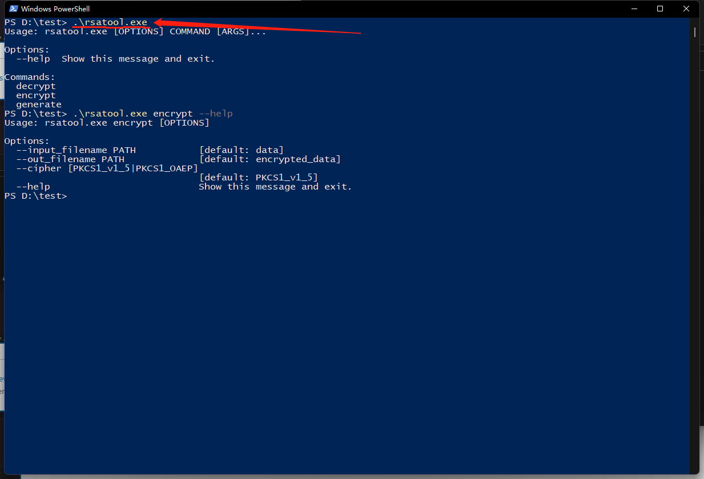

# RSAGenerator

A tools to generate rsa keys, encrypt and decrypt message.

## Usage
1. generate
   Generate rsa keys, will generate `public.pem` and `private.pem` in **current dir**.
2. encrypt
   Encrypt message, will read `public.pem`, `DATA` file and create `encrypted_data` in **current dir**
3. decrypt
   Decrypt message, will read `private.pem`, `encrypted_data` and create `decrypted_data` file in **current dir**.

### Windows
> You need download rsatool.exe from [Releases](https://github.com/MioYvo/RSAGenerator/releases) page.
Currently rsatool can only run in Windows Powershell or Windows Ternimal. No GUI.

1. Find and open your `rsatools.exe` folder .
2. Open Windows terminal or Windows PowerShell. 
   1. On Windows 11, just `right mouse click` at folder blank area.
   2. You can try `shift + right mouse click` at folder's blank area and choose "open a powershell window here"
3. type:
    ```
    rsatools.exe
    ```

    ```
    rsatools.exe generate
    ```

    ```
    # On default settings, you need put your message(to encypted) in a plain text file named "DATA" with NO suffix.
    rsatools.exe encrypt
    ```

    ```
    rsatools.exe decrypt
    ```

    add `--help` will print help message. 
    Example:
    ```
    PS D:\test> .\rsatool.exe encrypt --help
    Usage: rsatool.exe encrypt [OPTIONS]

    Options:
    --input_filename PATH           [default: data]
    --out_filename PATH             [default: encrypted_data]
    --cipher [PKCS1_v1_5|PKCS1_OAEP]
                                    [default: PKCS1_v1_5]
    --help                          Show this message and exit
    ```
    


