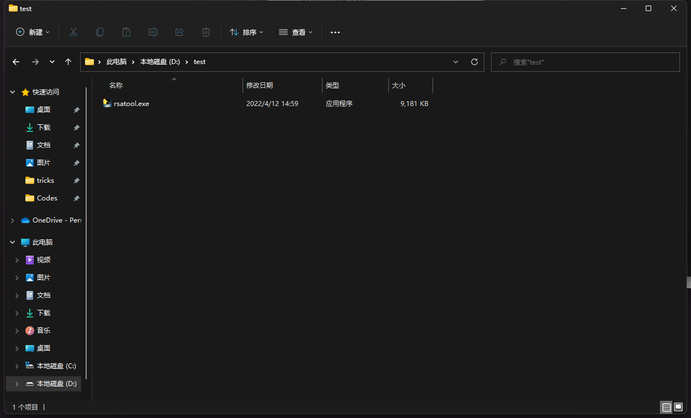
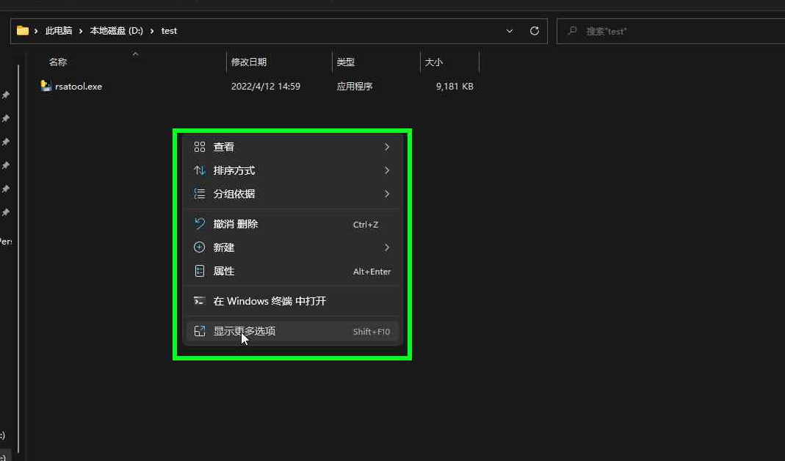
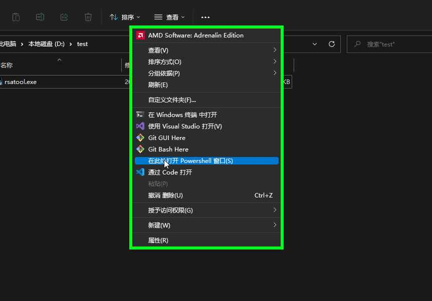
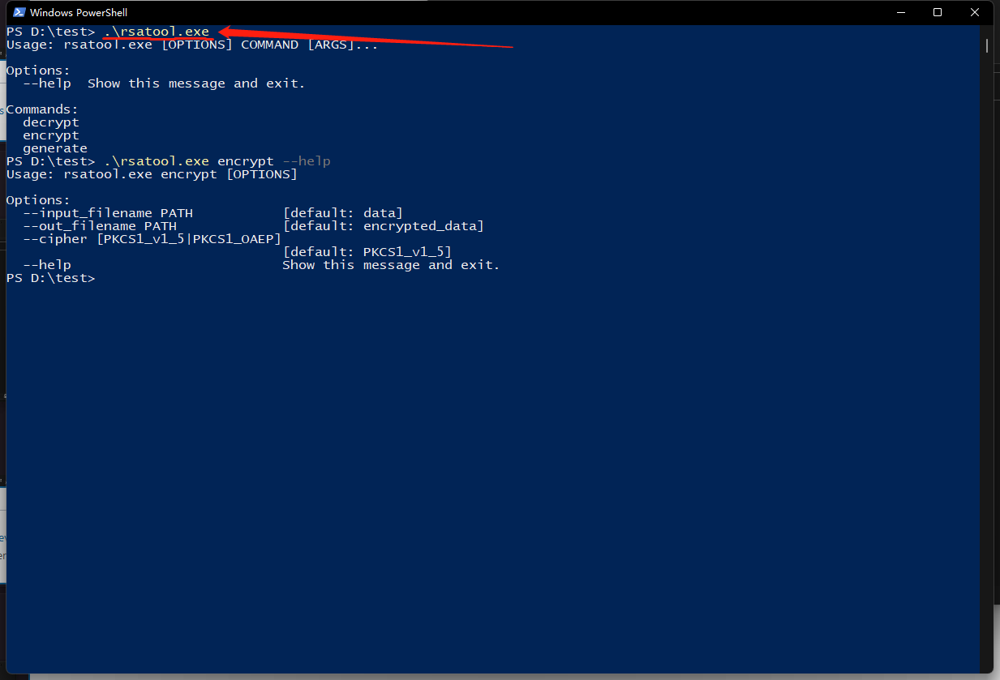

# RSAGenerator
RSAGenerator是一个RSA**命令行**小工具可以生成rsa公钥私钥对，加密、解密文本。

## 用法
1. 命令 `generate`: 
   生成公钥私钥对，会在**当前目录**生成 `public.pem` 和 `private.pem`。
2. 命令 `encrypt`: 
   加密文本, 会读取**当前目录**的`public.pem`和`DATA` 文件，创建加密后密文的`encrypted_data` 文件。
3. 命令 `decrypt`: 
   解密文本，会读取**当前目录**的`private.pem`和`encrypted_data`文件，创建解密后原文的 `decrypted_data`文件。

### Windows用户
> 请现在[Releases](https://github.com/MioYvo/RSAGenerator/releases) 页面下载`rsatool.exe`可执行文件.
目前rsatool仅发布了windows平台的exe文件。没有GUI。
1. 执行前请先关闭*腾讯电脑管家*等流氓软件。
2. 找到并打开 `rsatools.exe` 所在目录 .
2. 打开Windows终端. 
   1. Windows 11下, 可以 `右键单击` 该文件夹**空白处**，选择**在终端打开**.
   2. 也可尝试 `shift键 + 右键单击` 该文件夹**空白处**，选择 **在此处打开Powershell窗口**
3. 键入命令：
    ```
    rsatools.exe
    ```

    ```
    rsatools.exe generate
    ```

    ```
    # On default settings, you need put your message(to encypted) in a plain text file named "DATA" with NO suffix.
    rsatools.exe encrypt
    ```

    ```
    rsatools.exe decrypt
    ```

    add `--help` will print help message. 
    Example:
    ```
    PS D:\test> .\rsatool.exe encrypt --help
    Usage: rsatool.exe encrypt [OPTIONS]

    Options:
    --input_filename PATH           [default: data]
    --out_filename PATH             [default: encrypted_data]
    --cipher [PKCS1_v1_5|PKCS1_OAEP]
                                    [default: PKCS1_v1_5]
    --help                          Show this message and exit
    ```
    